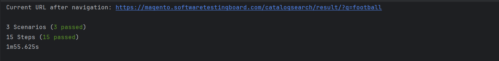
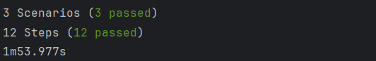
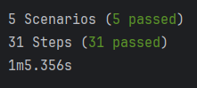
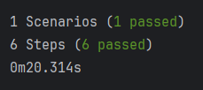
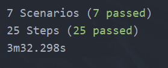

# Automated Web Testing Project

## Description

<p align="center">Our goal is to create a tasting framework that would comprehensively test the https://magento.softwaretestingboard.com/ website. We are looking at the functionality for the site, deriving user stories and creating test cases for said user stories, we also went through an exploratory testing phase where we looked at a number of features, most likely to produce defets.</p>

## Authors

- [Tomasz Wolak](https://github.com/BykuTom)
- [Christian Harborow](https://github.com/ChristianHarborow)
- [Duncan McCabe](https://github.com/dmac1954-sys)
- [Steven Diep](https://github.com/stevrnd)
- [Lachlan Caldwell](https://github.com/lachlan-caldwell)

## We are currently working on:

- Writing out gherking features
- Rolling out testing framework (pom)
- Exploratory Testing

## Features

### Test Framework using POM pattern

- Intended for reausabilty, this testing framework utilises POM pattern in order to reduce the amount of boiler plate code and enable an easily modifiable code to be produced.

### Gherkin scenarios

- Easy to understand Gherkin scenarios enable non-technical staff to understand and follow testing to foster greater colaboration between product owner.

### Defect reports

- Detailed defect reports, complete with steps on how to reproduce them have been made as a result of exploratory testing carried out by the team so that the developers can use them to improve the product.

## Getting Started

- Download chromedriver for your respective operating system from here: [Download Link](https://googlechromelabs.github.io/chrome-for-testing/), and place it in the resource folder like so:

```Arduino
Automated_Web_Testing/
└── src/
    └── test/
        └── resources/
            ├── Features/
            │   ├── login.feature
            │   ├── registration.feature
            │   ├── checkout.feature
            │   └── other features.
            ├── chromedriver.exe
            └── LICENSE.chromedriver
```

- Then download this repo using git clone command:

```shell
git clone https://github.com/BykuTom/WebProject.git

cd WebProject

```

- Once the project downloads, open the Automated_Web_Testing project in your IDE of choice, where code command represents the command to open your code editor.

```shell
cd Automated_Web_Testing
code .
```

- Before you're able to start working, download all dependencies using Maven.

## Test Metrics & Coverage

## Test Coverage

### Product Info

- Customer searches for specific product type to get info
- Customer searches for specific product to see reviews
- Customer searches for an out-of-stock or non-existent item



### Product Search

- The customer types the exact name of a product into the search bar and finds the product
- The customer types a partial product name into the search bar and finds the product
- The customer types a query into the search bar that does not match any product in the database



### Cart - Add to and Remove from

- Add single item to cart
- Add a quantity of the same item to cart
- Add an item that is already present in the cart
- Add two different items to the cart
- Add an additional variant of an already present item to the cart
- Remove the only item from the cart
- Remove an item from a cart with multiple item
- Reduce the quantity of an item within the cart




### Checkout

- Enter valid credentials for all required shipping fields


### Navigation

- Navigating to Create an Account page
- Navigating to Login page
- Navigating to Sale page
- Navigating to Jackets page
- Navigating to Basket
- Navigating to individual item from Men's short's page
- Navigating directly to an individual items



### Order History

- As a signed in user I am trying to access my order page, having never ordered any items
- As a signed in user I am trying to access my order page, having previously placed an order
- As an unsigned user I attempt to access my order page directly
- As a signed in user I am attempting to access an order's detail
